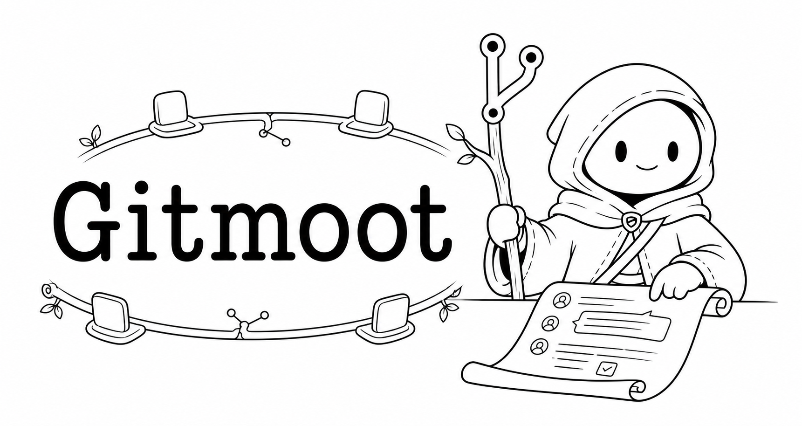

<p align="center">
  
</p>

# Gitmoot

Local-first multi-agent coordination for GitHub pull request workflows.

[](./LICENSE)
[](https://github.com/plotarmordev/gitmoot/releases)
[](./go.mod)

Gitmoot lets humans and AI agents collaborate through the place software teams
already audit work: GitHub pull requests. It runs on the user's machine, keeps
workflow state in local SQLite, routes PR comments to registered agent
runtimes, and writes the agent's work back into the repo and PR discussion.

V1 is intentionally local-only. There is no hosted dashboard, webhook receiver,
cloud runner, or remote control plane.

## Why Gitmoot

AI agents can already edit code, review diffs, and run local tools. The hard
part is coordinating that work across sessions without losing the human audit
trail. Gitmoot makes the repository and its pull requests the shared surface:

- PR comments become agent tasks, review requests, retries, and merge signals.
- Local SQLite records agents, repos, jobs, goals, tasks, PRs, and branch locks.
- Runtime adapters keep Codex, Claude Code, and future runtimes behind the same
  Gitmoot agent model.
- Agent Templates and job snapshots make agent instructions explicit and reproducible.
- Humans can follow progress from GitHub while agents keep working locally.

## How It Works

```text
GitHub PR comments/state
  -> local gitmoot daemon
  -> local SQLite state machine and job mailbox
  -> registered runtime adapter
  -> Codex, Claude Code, shell, or another agent runtime
  -> GitHub PR comments, statuses, branches, PRs, and merges
```

The core primitive is a runtime-neutral Gitmoot agent, not a Codex-specific
session. Codex and Claude Code are adapters behind the same internal runtime
contract.

## Install

```sh
curl -fsSL https://gitmoot.io/install.sh | sh
gitmoot version
gh auth status
```

Install runtime plugin guidance when you want Codex or Claude Code to discover
Gitmoot's Agent Skill from their plugin systems:

```sh
gitmoot plugin install codex
gitmoot plugin install claude
gitmoot plugin doctor
```

The plugins are discovery and guidance surfaces. The `gitmoot` CLI and local
daemon remain the execution path.

## Quick Start

From a project checkout:

```sh
gitmoot init
gitmoot repo add owner/repo --path . --poll 30s
gitmoot doctor --repo .
```

Start a Gitmoot-managed Codex agent and daemon:

```sh
gitmoot agent start project-planner \
  --runtime codex \
  --repo owner/repo \
  --path . \
  --template planner \
  --start-daemon
```

For fast planning in the current Codex or Claude chat, ask the runtime:

```text
Use the Gitmoot planner here. Write the implementation plan.
```

That uses the same `planner` template as the background agent, but imports the
prompt into the current chat instead of creating a Gitmoot job.

Ask the registered background planner when you want a queued Gitmoot job:

```sh
gitmoot agent ask project-planner --repo owner/repo --background "Write the implementation plan and goal file."
gitmoot job watch <job-id>
```

Background jobs are conservative by default. The daemon starts with one worker,
runtime session locks serialize jobs for the same Codex or Claude session, repo
checkout locks protect local checkouts, and branch locks protect implementation
ownership.

Route work through PR comments:

```text
/gitmoot project-planner ask Write a task-by-task implementation plan for this PR.
/gitmoot thermo-review review
/gitmoot retry <job-id>
```

For the full walkthrough, see [docs/local-workflow.md](docs/local-workflow.md).

## Core Concepts

- **Repo**: a GitHub repository plus local checkout path that Gitmoot is allowed
  to monitor and mutate.
- **Daemon**: the local background process that polls GitHub PRs and routes
  queued jobs.
- **Agent**: a named Gitmoot identity with repo access, role, capabilities, and
  a runtime adapter.
- **Runtime adapter**: the bridge from Gitmoot jobs to Codex, Claude Code,
  shell commands, or future runtimes.
- **Template**: cached prompt content attached to an agent and snapshotted into
  each job.
- **Job**: a routed unit of work created from a PR comment, local ask, task run,
  retry, or merge action.
- **Goal and task**: Markdown implementation plans imported into local Gitmoot
  state with `gitmoot goal import`.
- **Branch lock**: local coordination state that prevents multiple agents from
  racing on the same branch.

## Common Workflows

### Planner Agent

Gitmoot includes `planner` for structured implementation planning
and standard goal-file writing.

```sh
gitmoot agent template update planner
gitmoot agent start project-planner \
  --runtime codex \
  --repo owner/repo \
  --path . \
  --template planner \
  --start-daemon
```

### Review Agent

Gitmoot includes `thermo-nuclear-code-quality-review` for strict review-only
work.

```sh
gitmoot agent template update thermo-nuclear-code-quality-review
gitmoot agent start thermo-review \
  --runtime codex \
  --repo owner/repo \
  --template thermo-nuclear-code-quality-review \
  --start-daemon
```

Ask it from a PR comment:

```text
/gitmoot thermo-review review
```

### Custom Prompt Agents

Custom agent templates let you keep a local template file and bind its
snapshotted instructions to any Gitmoot agent.

```sh
mkdir -p agents
gitmoot agent template draft frontend-reviewer --output agents/frontend-reviewer.md
$EDITOR agents/frontend-reviewer.md
gitmoot agent template validate agents/frontend-reviewer.md
gitmoot agent template add frontend-reviewer --file agents/frontend-reviewer.md
gitmoot agent start frontend-reviewer \
  --runtime codex \
  --repo owner/repo \
  --template frontend-reviewer \
  --role reviewer \
  --capability ask \
  --capability review
```

After editing the template file, refresh the cached snapshot:

```sh
gitmoot agent template diff frontend-reviewer
gitmoot agent template update frontend-reviewer
```

Template updates are versioned locally. `gitmoot agent template show <id>`
prints the current version, content hash, source commit, and promotion state.
Agents use the current promoted version by default, or a pinned version when
configured with a reference such as `--template frontend-reviewer@v1`.
Queued jobs keep the exact template content snapshot they were created with.

Discover templates by metadata:

```sh
gitmoot agent template list --runtime codex --output goal_file
gitmoot agent template list --tag review --capability ask
gitmoot agent template show frontend-reviewer
```

Reuse a custom agent prompt in the current Codex or Claude chat without
starting a background job:

```text
Use frontend-reviewer here. Review this diff.
```

The runtime should load the prompt with:

```sh
gitmoot agent prompt frontend-reviewer
```

### Template Capture

Template capture turns a useful current Codex or Claude chat workflow into a
reusable agent template. Capture happens in the current chat from visible
conversation context and inspected files; Gitmoot does not read hidden model
state or runtime memory.

Draft a blank structure when starting from scratch:

```sh
gitmoot agent template draft release-planner
```

Or ask the current chat to fill the structure from the visible session:

```text
Use Gitmoot to capture this session as agent template release-planner. Draft only.
```

Review the draft before installing it:

```sh
gitmoot agent template validate .gitmoot/templates/release-planner.md
gitmoot agent template add release-planner --file .gitmoot/templates/release-planner.md
gitmoot agent prompt release-planner
```

Installed custom templates are snapshots. After editing the source file, run
`gitmoot agent template diff <id>` and `gitmoot agent template update <id>`.

### Jobs, Locks, And Recovery

```sh
gitmoot status --repo owner/repo
gitmoot events --repo owner/repo
gitmoot job list --repo owner/repo
gitmoot job show <job-id>
gitmoot daemon logs
gitmoot lock list --repo owner/repo
gitmoot lock release owner/repo <branch> --owner <agent>
```

### SkillOpt Exchange

```sh
gitmoot skillopt export --run <run-id> --output training.json
gitmoot skillopt import --file candidate.json
gitmoot skillopt feedback markdown export --run <run-id> --output .gitmoot/evals/<run-id>
gitmoot skillopt feedback markdown import --packet .gitmoot/evals/<run-id>
```

The export/import boundary lets a future external `gitmoot-skillopt` optimizer
train on local eval artifacts and return candidate template versions. Imported
candidates stay pending until a human review workflow promotes them.

Detailed command coverage lives in
[skills/gitmoot/references/CLI.md](skills/gitmoot/references/CLI.md).

## Plugins

Gitmoot can package its Agent Skill for Codex and Claude Code so the runtime
can discover Gitmoot guidance from its plugin system.

```sh
gitmoot plugin install codex
gitmoot plugin install claude
gitmoot plugin doctor
```

Plugins do not start a hosted service, replace the daemon, subscribe agents, or
mutate repository state by themselves. See [docs/plugins.md](docs/plugins.md)
for install details and troubleshooting.

## Documentation

- [Hosted docs](https://gitmoot.io/docs/intro)
- [LLM index](https://gitmoot.io/llms.txt)
- [Agent Skills package](skills/gitmoot/SKILL.md)
- [CLI reference](skills/gitmoot/references/CLI.md)
- [Codex and Claude plugins](docs/plugins.md)
- [Local workflow walkthrough](docs/local-workflow.md)
- [Beta smoke tests](docs/beta-smoke-tests.md)
- [Runtime adapter authoring](docs/adapters.md)
- [Troubleshooting](docs/troubleshooting.md)

## Status And V1 Limits

- Local-only: no hosted dashboard, GitHub App bot identity, cloud runner, or
  remote control plane.
- Polling watches GitHub PRs; there is no webhook receiver in V1.
- GitHub comments are authored by the authenticated `gh` user. Agent identity
  appears in the comment body.
- Local SQLite remains the workflow source of truth.

## Contributing

Gitmoot is early. Keep changes scoped, preserve local-first behavior, and add
focused tests for runtime, CLI, daemon, plugin, or workflow changes. Before
opening a PR, run the relevant checks for the files you touched.

## License

Gitmoot is licensed under the [Apache License 2.0](./LICENSE). See
[NOTICE](./NOTICE) for copyright and attribution details.

## Development

```sh
go test ./...
go vet ./...
```
